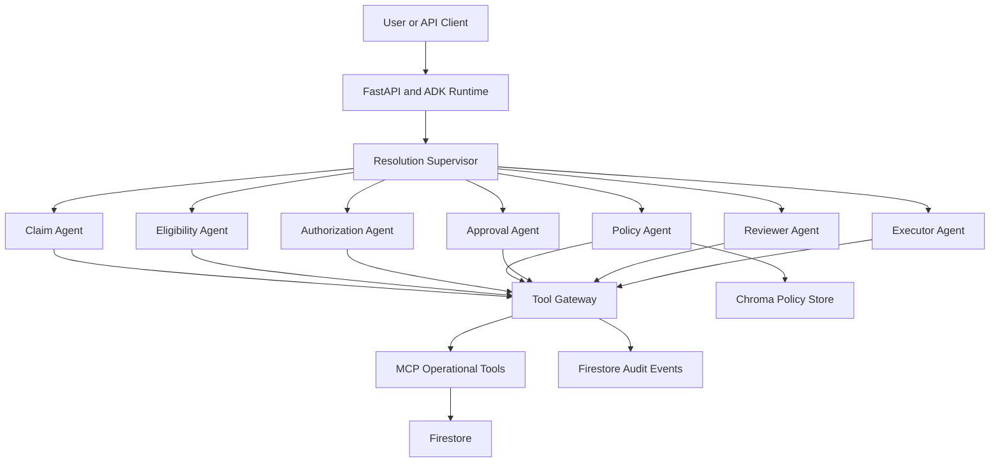
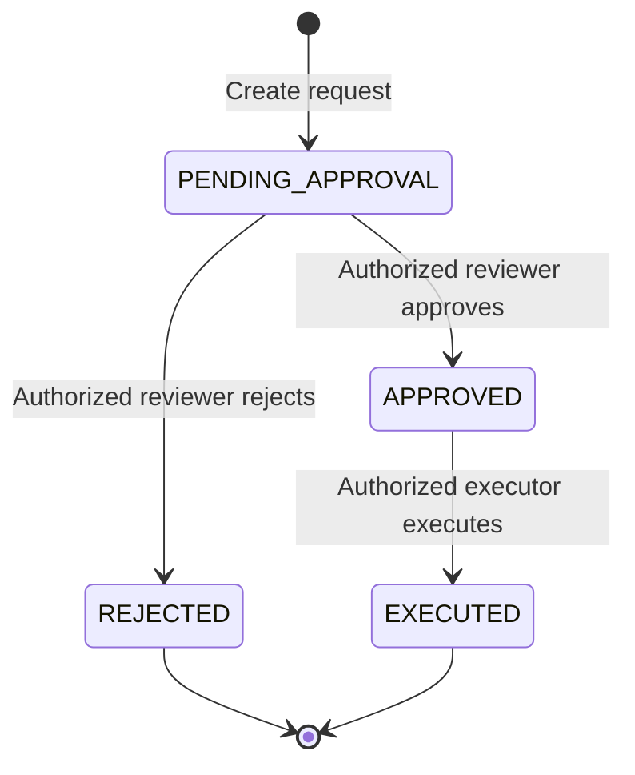

# MemResolveAI

MemResolveAI is a governed multi-agent healthcare claim-resolution platform built with Google ADK, Gemini on Vertex AI, MCP, Firestore, Chroma, FastAPI, Docker, and Cloud Run.

The system investigates denied healthcare claims, correlates claim, eligibility, authorization, and policy evidence, recommends a resolution, and governs sensitive actions through explicit human approval.

## Business Scenario

The primary demonstration investigates claim `CLM-20045`.

- Claim procedure code: `72148`
- Authorized procedure code: `72141`
- Authorization: `AUTH-9001`
- Denial code: `AUTH_CODE_MISMATCH`
- Member coverage: active on the service date
- Authorization status: approved
- Root cause: billed and authorized procedure codes do not match

The system can recommend correction, resubmission, or clinical review, but it cannot perform controlled actions without the required human approval.

## Architecture



## Agents

| Agent | Responsibility |
|---|---|
| `resolution_supervisor` | Coordinates specialists and synthesizes evidence |
| `claim_agent` | Retrieves claim and denial information |
| `eligibility_agent` | Determines coverage on the service date |
| `authorization_agent` | Retrieves prior-authorization evidence |
| `policy_agent` | Retrieves applicable policy and resolution guidance |
| `approval_agent` | Creates and retrieves pending approval requests |
| `reviewer_agent` | Approves or rejects requests using an authorized reviewer |
| `executor_agent` | Executes an approved action exactly once |

## Investigation Workflow

1. The supervisor retrieves the claim.
2. It extracts the member, provider, service date, codes, denial, and authorization ID.
3. It verifies eligibility for the service date.
4. It retrieves and compares the authorization.
5. It searches the policy knowledge base.
6. It synthesizes the evidence and identifies the root cause.
7. It recommends the next step.
8. It does not create an approval request or execute an action unless explicitly requested.

A standard investigation uses this agent trajectory:

```text
claim_agent
eligibility_agent
authorization_agent
policy_agent
```

## Governed Action Workflow



Supported controlled actions:

- `REVIEW_CODE_MISMATCH`
- `CORRECT_AND_RESUBMIT`
- `REQUEST_CLINICAL_REVIEW`

Governance rules include:

- A request starts in `PENDING_APPROVAL`.
- The requester cannot review their own request.
- Only a pending request can be approved or rejected.
- Approval does not automatically trigger execution.
- Only an approved request can be executed.
- Execution is idempotent.
- An executed request cannot be executed again.
- Every gateway operation produces an audit event.

## Tool Gateway

All agent-accessible tools pass through a governed Tool Gateway.

The gateway verifies:

- Tool registration
- Calling agent
- Required user role
- Risk classification
- Approval requirements
- Correlation metadata

Tool risk levels:

| Risk | Purpose |
|---|---|
| `READ` | Retrieve claims, eligibility, authorization, policy, or records |
| `APPROVAL` | Create, approve, or reject approval requests |
| `WRITE` | Execute an approved claim-resolution action |

## End-to-End Audit Correlation

Requests to `/run` and `/run_sse` may include:

```text
X-Correlation-ID
X-MemResolve-User-ID
X-MemResolve-Roles
```

The request context propagates through the supervisor, specialist agents, Tool Gateway, and Firestore audit events.

Example audit context:

```json
{
  "user_id": "cloud-context-user",
  "correlation_id": "corr-cloud-context-002",
  "outcome": "SUCCEEDED"
}
```

For this private demonstration, identity and role headers provide request context. A production deployment must derive roles from a trusted identity provider or gateway and must not trust arbitrary caller-supplied role headers.

## Technology Stack

- Python 3.12
- Google Agent Development Kit
- Gemini 2.5 Flash
- Vertex AI
- FastAPI and Uvicorn
- Model Context Protocol
- Google Cloud Firestore
- Chroma
- Pydantic
- SQLAlchemy and SQLite
- pytest
- uv
- Docker
- Google Cloud Run

## Project Structure

```text
MemResolveAI/
├── data/
│   └── policies/
├── evaluations/
├── mem_resolve_app/
│   ├── agents/
│   ├── approvals/
│   ├── knowledge/
│   ├── mcp_client/
│   ├── models/
│   ├── repositories/
│   ├── services/
│   ├── tool_gateway/
│   └── tools/
├── mem_resolve_mcp/
├── scripts/
├── tests/
├── Dockerfile
├── main.py
├── pyproject.toml
└── uv.lock
```

## Local Setup

Install Python 3.12 and synchronize the environment:

```bash
uv sync --group dev --group local-rag
```

Create `.env` from the example configuration:

```bash
cp .env.example .env
```

Authenticate for local Google Cloud access:

```bash
gcloud auth application-default login
gcloud config set project memresolve-ai-rohid35
```

Index the policy documents:

```bash
uv run python -m scripts.index_chroma
```

Seed the Firestore demonstration data:

```bash
uv run python -m scripts.seed_firestore
```

Verify application readiness:

```bash
uv run python -m scripts.verify_readiness
```

Run the test suite:

```bash
uv run pytest -q
```

Expected verified result:

```text
23 passed
```

## Run Locally

Start the FastAPI and ADK application:

```bash
uv run python main.py
```

The service is available at:

```text
http://localhost:8080
```

Health check:

```bash
curl -sS http://localhost:8080/health \
  | python3 -m json.tool
```

## Run with Docker

Build the image:

```bash
docker build -t memresolve-ai:local .
```

Run it with local Application Default Credentials:

```bash
docker run -d \
  --name memresolve-ai-local \
  -p 8081:8080 \
  --env-file .env \
  -e GOOGLE_APPLICATION_CREDENTIALS=/gcp/application_default_credentials.json \
  -e SESSION_SERVICE_URI=sqlite+aiosqlite:////tmp/memresolve/session.db \
  -v "$HOME/.config/gcloud/application_default_credentials.json:/gcp/application_default_credentials.json:ro" \
  memresolve-ai:local
```

Check container health:

```bash
curl -sS http://localhost:8081/health \
  | python3 -m json.tool
```

## Cloud Run Deployment

Prepare the required Google Cloud services and runtime identity:

```bash
./scripts/setup_gcp.sh
```

Deploy the application:

```bash
./scripts/deploy_cloud_run.sh
```

Current deployment:

```text
Project: memresolve-ai-rohid35
Region: us-central1
Service: memresolve-ai
Revision: memresolve-ai-00002-8bx
```

Test the private service:

```bash
SERVICE_URL="https://memresolve-ai-231631526961.us-central1.run.app"
IDENTITY_TOKEN="$(gcloud auth print-identity-token)"

curl -sS \
  -H "Authorization: Bearer $IDENTITY_TOKEN" \
  "$SERVICE_URL/health" \
  | python3 -m json.tool
```

## Verified Cloud Scenario

The Cloud Run deployment successfully performed the following read-only investigation:

```text
User request
    -> claim_agent
    -> eligibility_agent
    -> authorization_agent
    -> policy_agent
    -> evidence-based response
```

Verified controls:

- Cloud Run authentication succeeded.
- Claim investigation returned the correct root cause.
- No approval or execution tool was invoked.
- All four audit events recorded `SUCCEEDED`.
- All four events contained the same request user.
- All four events contained the same correlation ID.
- Firestore business and audit data remained persistent.
- The containerized MCP subprocess inherited the required environment.

## Testing Strategy

The automated tests cover:

- Tool registration and authorization
- Agent and role restrictions
- Request-context propagation
- Approval validation
- Segregation of duties
- Review state transitions
- Execution state validation
- Idempotent execution
- MCP and application readiness behavior

ADK evaluation sets can additionally measure model-level regression, including:

- Expected tool trajectory
- Response quality
- Policy-grounded reasoning
- Prohibited action avoidance

## Current Limitations

- ADK session state uses SQLite under `/tmp` on Cloud Run.
- Session history can be lost when a Cloud Run instance restarts.
- SQLite sessions are not shared between multiple Cloud Run instances.
- Chroma is packaged into the container and is read-only at runtime.
- Request role headers are demonstration metadata rather than production-grade authorization claims.

Firestore claim, authorization, eligibility, approval, execution, and audit records remain durable.

A production version should use durable managed session storage and derive authorization roles from verified enterprise identity claims.

## Interview Summary

MemResolveAI demonstrates a Level-3-style supervisor architecture in which a central agent coordinates specialized agents and governed tools.

The key design principle is that the LLM performs reasoning and orchestration, while deterministic services enforce business rules, authorization, state transitions, auditing, and idempotency.

The platform separates:

- Reasoning from execution
- Retrieval from mutation
- Requesting from reviewing
- Approval from execution
- Model behavior from deterministic governance

This enables useful agentic automation without giving the model unrestricted authority over healthcare claim operations.